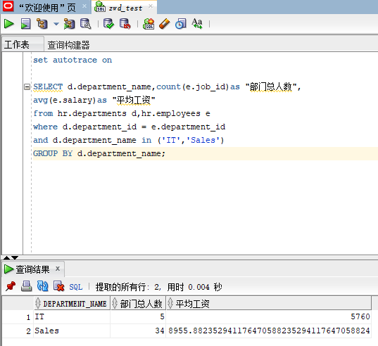
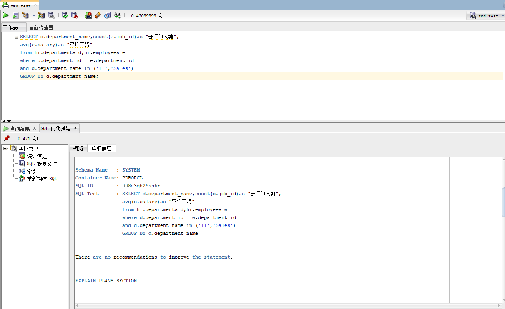
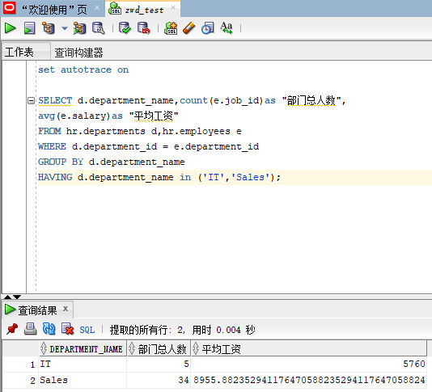
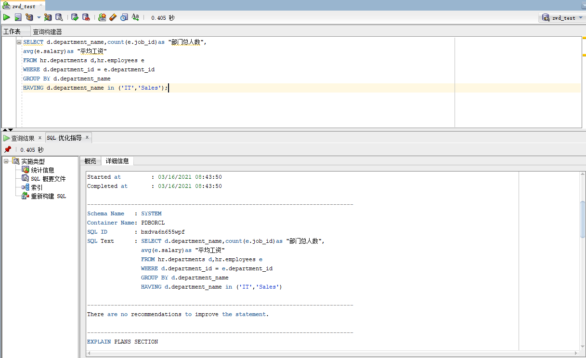

# 我的作业一

### 姓名：晏康文     班级：软件工程2班     学号：201810414225

## 实验目的
    分析SQL执行计划，执行SQL语句的优化指导。理解分析SQL语句的执行计划的重要作用。

## 实验内容
1. 对Oracle12c中的HR人力资源管理系统中的表进行查询与分析。
2. 首先运行和分析教材中的样例：本训练任务目的是查询两个部门('IT'和'Sales')的部门总人数和平均工资，以下两个查询的结果是一样的。但效率不相同。
3. 设计自己的查询语句，并作相应的分析，查询语句不能太简单。

## 实验步骤

### 查询语句1
```sql
    set autotrace on

    SELECT d.department_name,count(e.job_id)as "部门总人数",
    avg(e.salary)as "平均工资"
    from hr.departments d,hr.employees e
    where d.department_id = e.department_id
    and d.department_name in ('IT','Sales')
    GROUP BY d.department_name;
```
<p>1.使用第一个语句进行查询</p>



<p>2.优化建议如下</p>


没有优化建议

### 查询语句2
```sql
    set autotrace on

    SELECT d.department_name,count(e.job_id)as "部门总人数",
    avg(e.salary)as "平均工资"
    FROM hr.departments d,hr.employees e
    WHERE d.department_id = e.department_id
    GROUP BY d.department_name
    HAVING d.department_name in ('IT','Sales');
```
<p>3.使用第二个语句进行查询</p>



<p>4.优化建议如下</p>


没有优化建议

>**分析1**:第一个语句是 先由where子句筛选符合条件的所有匹配项，再由group by按部门名分组。最后聚合函数count统计人数、avg计算平均工资。

>**分析2**:第二个语句依然由where子句筛选部门id相等的项，但是判断部门条件，直接由group by按部门名分组，然后对每个分组筛选部门再IT或Sales中的项，最后由聚合函数count统计人数、avg计算平均工资。

>**总结**:上述两个语句中，第二个语句的执行效率更高。第一个语句的判断条件更多，在数据量过大时，会显著降低运行效率。

### 自己设计查询语句

```sql
set autotrace on

select d.department_name, count(*) as "部门总人数",
avg(e.salary) as "平均工资"
from hr.departments d, hr.employees e
where d.department_id = e.department_id
GROUP BY d.department_name
HAVING d.department_name in ('IT','Sales');
```
>**分析**:我所设计的查询语句更改了统计人数的地方，改为直接统计全部人数，因为分组已经完成，所以可以直接进行统计，更加方便。