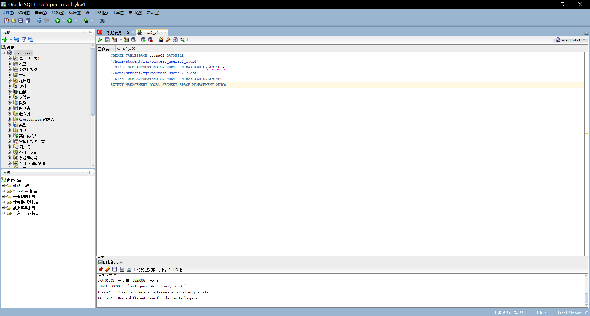
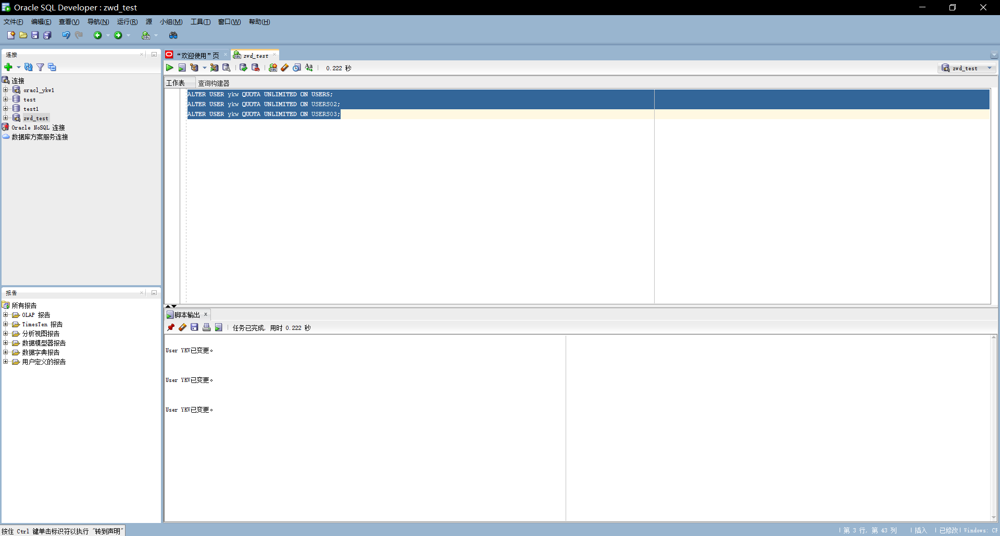
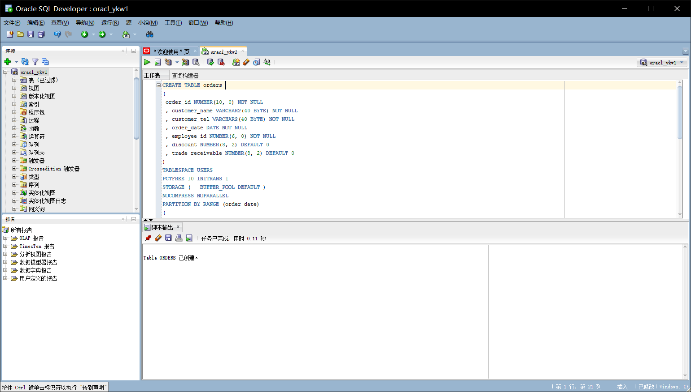
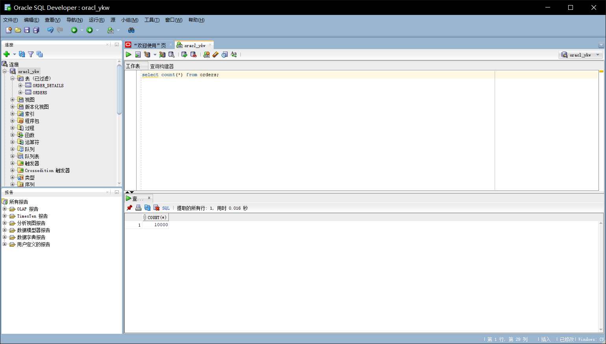
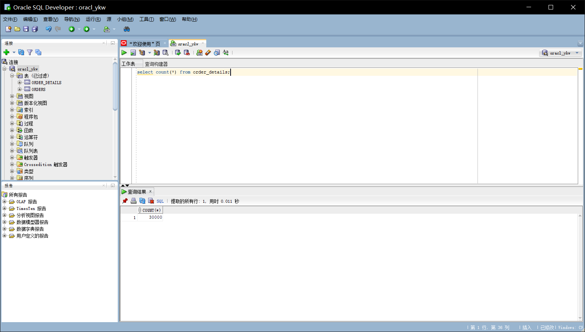
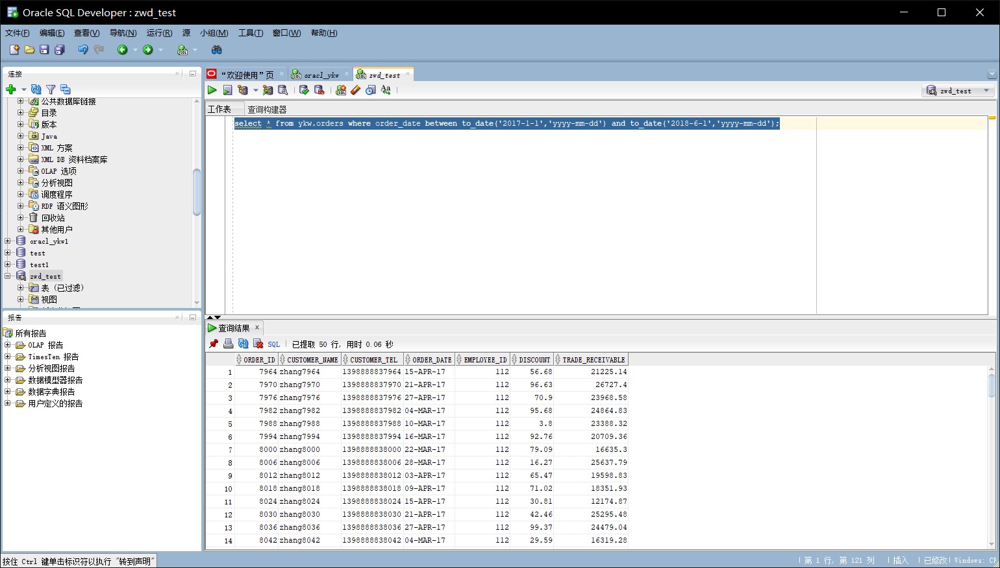
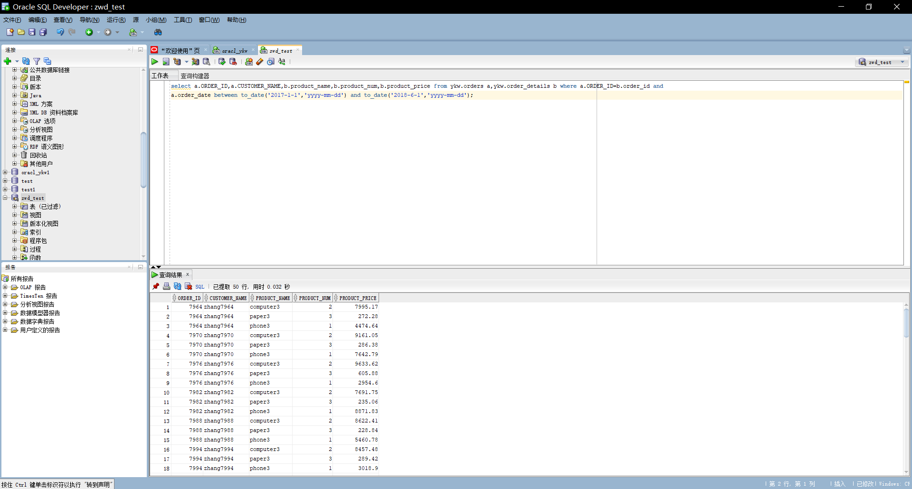

# 实验3：创建分区表

### 姓名：晏康文     班级：软件工程2班     学号：201810414225

## 实验目的：

掌握分区表的创建方法，掌握各种分区方式的使用场景。

## 实验内容：
- 本实验使用3个表空间：USERS,USERS02,USERS03。在表空间中创建两张表：订单表(orders)与订单详表(order_details)。
- 使用**你自己的账号创建本实验的表**，表创建在上述3个分区，自定义分区策略。
- 你需要使用system用户给你自己的账号分配上述分区的使用权限。你需要使用system用户给你的用户分配可以查询执行计划的权限。
- 表创建成功后，插入数据，数据能并平均分布到各个分区。每个表的数据都应该大于1万行，对表进行联合查询。
- 写出插入数据的语句和查询数据的语句，并分析语句的执行计划。
- 进行分区与不分区的对比实验。

## 实验步骤

- 创建表空间users02
  
```sql
CREATE TABLESPACE users02 DATAFILE
'/home/student/ykw/pdbtest_users02_1.dbf'
  SIZE 100M AUTOEXTEND ON NEXT 50M MAXSIZE UNLIMITED，
'/home/student/ykw/pdbtest_users02_2.dbf' 
  SIZE 100M AUTOEXTEND ON NEXT 50M MAXSIZE UNLIMITED
EXTENT MANAGEMENT LOCAL SEGMENT SPACE MANAGEMENT AUTO;
```



- 修改权限
  
```sql
ALTER USER ykw QUOTA UNLIMITED ON USERS;
ALTER USER ykw QUOTA UNLIMITED ON USERS02;
ALTER USER ykw QUOTA UNLIMITED ON USERS03;
```



- 创建orders表:

```sql
CREATE TABLE orders 
(
 order_id NUMBER(10, 0) NOT NULL 
 , customer_name VARCHAR2(40 BYTE) NOT NULL 
 , customer_tel VARCHAR2(40 BYTE) NOT NULL 
 , order_date DATE NOT NULL 
 , employee_id NUMBER(6, 0) NOT NULL 
 , discount NUMBER(8, 2) DEFAULT 0 
 , trade_receivable NUMBER(8, 2) DEFAULT 0 
) 
TABLESPACE USERS 
PCTFREE 10 INITRANS 1 
STORAGE (   BUFFER_POOL DEFAULT ) 
NOCOMPRESS NOPARALLEL 
PARTITION BY RANGE (order_date) 
(
 PARTITION PARTITION_BEFORE_2016 VALUES LESS THAN (
 TO_DATE(' 2016-01-01 00:00:00', 'SYYYY-MM-DD HH24:MI:SS', 
 'NLS_CALENDAR=GREGORIAN')) 
 NOLOGGING 
 TABLESPACE USERS 
 PCTFREE 10 
 INITRANS 1 
 STORAGE 
( 
 INITIAL 8388608 
 NEXT 1048576 
 MINEXTENTS 1 
 MAXEXTENTS UNLIMITED 
 BUFFER_POOL DEFAULT 
) 
NOCOMPRESS NO INMEMORY  
, PARTITION PARTITION_BEFORE_2017 VALUES LESS THAN (
TO_DATE(' 2017-01-01 00:00:00', 'SYYYY-MM-DD HH24:MI:SS', 
'NLS_CALENDAR=GREGORIAN')) 
NOLOGGING 
TABLESPACE USERS02 
...
);
```



- 创建order_details表，语句如下：

``` sql
CREATE TABLE order_details 
(
id NUMBER(10, 0) NOT NULL 
, order_id NUMBER(10, 0) NOT NULL
, product_id VARCHAR2(40 BYTE) NOT NULL 
, product_num NUMBER(8, 2) NOT NULL 
, product_price NUMBER(8, 2) NOT NULL 
, CONSTRAINT order_details_fk1 FOREIGN KEY  (order_id)
REFERENCES orders  (  order_id   )
ENABLE 
) 
TABLESPACE USERS 
PCTFREE 10 INITRANS 1 
STORAGE (   BUFFER_POOL DEFAULT ) 
NOCOMPRESS NOPARALLEL
PARTITION BY REFERENCE (order_details_fk1)
(
PARTITION PARTITION_BEFORE_2016 
NOLOGGING 
TABLESPACE USERS --必须指定表空间,否则会将分区存储在用户的默认表空间中
...
) 
NOCOMPRESS NO INMEMORY, 
PARTITION PARTITION_BEFORE_2017 
NOLOGGING 
TABLESPACE USERS02
...
) 
NOCOMPRESS NO INMEMORY  
);
```

- 查询是否创建成功

```sql
select count(*) from orders;
select count(*) from order_details;
```




- 查找orders中日期在2017-1-1到2018-6-1间的数据:

```sql
select * from ykw.orders where order_date between to_date('2017-1-1','yyyy-mm-dd') and to_date('2018-6-1','yyyy-mm-dd');
```



- 查找ORDER_ID,CUSTOMER_NAME,product_name,product_num,product_price

```sql
select a.ORDER_ID,a.CUSTOMER_NAME,b.product_name,b.product_num,b.product_price from ykw.orders a,ykw.order_details b where a.ORDER_ID=b.order_id and a.order_date between to_date('2017-1-1','yyyy-mm-dd') and to_date('2018-6-1','yyyy-mm-dd');
```



## 实验总结
  通过本次实验，我掌握了分区表的创建方法，也掌握各种分区方式的使用场景。