# 实验4：对象管理

## 实验目的：
了解Oracle表和视图的概念，学习使用SQL语句Create Table创建表，学习Select语句插入，修改，删除以及查询数据，学习使用SQL语句创建视图，学习部分存储过程和触发器的使用。
## - 实验场景：
假设有一个生产某个产品的单位，单位接受网上订单进行产品的销售。通过实验模拟这个单位的部分信息：员工表，部门表，订单表，订单详单表。

## 实验内容：
### 录入数据：
要求至少有1万个订单，每个订单至少有4个详单。至少有两个部门，每个部门至少有1个员工，其中只有一个人没有领导，一个领导至少有一个下属，并且它的下属是另一个人的领导（比如A领导B，B领导C）。

###  序列的应用
插入ORDERS和ORDER_DETAILS 两个表的数据时，主键ORDERS.ORDER_ID, ORDER_DETAILS.ID的值必须通过序列SEQ_ORDER_ID和SEQ_ORDER_ID取得，不能手工输入一个数字。

###  触发器的应用：
维护ORDER_DETAILS的数据时（insert,delete,update）要同步更新ORDERS表订单应收货款ORDERS.Trade_Receivable的值。

###  查询数据：
    1.查询某个员工的信息
    2.递归查询某个员工及其所有下属，子下属员工。
    3.查询订单表，并且包括订单的订单应收货款: Trade_Receivable= sum(订单详单表.ProductNum*订单详单表.ProductPrice)- Discount。
    4.查询订单详表，要求显示订单的客户名称和客户电话，产品类型用汉字描述。
    5.查询出所有空订单，即没有订单详单的订单。
    6.查询部门表，同时显示部门的负责人姓名。
    7.查询部门表，统计每个部门的销售总金额。

## 表结构

- 部门表DEPARTMENTS,表空间：USERS

|编号|字段名|数据类型|可以为空|注释|
|---|---|---|---|---|
|1|DEPARTMENT_ID|NUMBER(6,0)|NO|部门ID，主键|
|2|DEPARTMENT_NAME|VARCHAR2(40 BYTE)|NO|部门名称，非空|

- 产品表PRODUCTS,表空间：USERS

|编号|字段名|数据类型|可以为空|注释|
|---|---|---|---|---|
|1|PRODUCT_NAME|VARCHAR2(40 BYTE)|NO|产品名称，产品表的主键|
|2|PRODUCT_TYPE|VARCHAR2(40 BYTE)|NO|产品类型，只能取值：耗材,手机,电脑|

- 员工表EMPLOYEES,表空间：USERS

|编号|字段名|数据类型|可以为空|注释|
|---|---|---|---|---|
|1|EMPLOYEE_ID|NUMBER(6,0)|NO|员工ID，员工表的主键。|
|2|NAME|VARCHAR2(40 BYTE)|NO|员工姓名，不能为空，创建不唯一B树索引。|
|3|EMAIL|VARCHAR2(40 BYTE)|YES|电子信箱|
|4|PHONE_NUMBER|VARCHAR2(40 BYTE)|YES|电话|
|5|HIRE_DATE|DATE|NO|雇佣日期|
|6|SALARY|NUMBER(8,2)|YES|月薪，必须>0|
|7|MANAGER_ID|NUMBER(6,0)|YES|员工的上司，是员工表EMPOLYEE_ID的外键，MANAGER_ID不能等于EMPLOYEE_ID,即员工的领导不能是自己。主键删除时MANAGER_ID设置为空值。|
|8|DEPARTMENT_ID|NUMBER(6,0)|YES|员工所在部门，是部门表DEPARTMENTS的外键|
|9|PHOTO|BLOB|YES|员工照片

- 订单表ORDERS, 表空间：分区表：USERS,USERS02

|编号|字段名|数据类型|可以为空|注释|
|---|---|---|---|---|
|1|ORDER_ID|NUMBER(10,0)|NO|订单编号，主键，值来自于序列：SEQ_ORDER_ID|
|2|CUSTOMER_NAME|VARCHAR2(40 BYTE)|NO|客户名称，B树索引|
|3|CUSTOMER_TEL|VARCHAR2(40 BYTE)|NO|客户电话|
|4|ORDER_DATE|DATE|NO|订单日期，根据该属性分区存储：2015年及以前的数据存储在USERS表空间，2016年及以后的数据存储在USERS02表空间中。|
|5|EMPLOYEE_ID|NUMBER(6,0)|NO|订单经手人，员工表EMPLOYEES的外键|
|6|DISCOUNT|Number(8,2)|YES|订单整体优惠金额。默认值为0|
|7|TRADE_RECEIVABLE|Number(8,2)|YES|订单应收货款，默认为0，Trade_Receivable= sum(订单详单表.Product_Num*订单详单表.Product_Price)- Discount|

- 订单详单表ORDER_DETAILS, 表空间：分区表：USERS,USERS02，分区参照ORDERS表。

|编号|字段名|数据类型|可以为空|注释|
|---|---|---|---|---|
|1|ID|NUMBER(10,0)|NO|本表的主键，值来自于序列：SEQ_ORDER_DETAILS_ID|
|2|ORDER_ID|NUMBER(10,0)|NO|所属的订单号，订单表ORDERS的外键|
|4|PRODUCT_NAME|VARCHAR2(40 BYTE)|NO|产品名称, 是产品表PRODUCTS的外键|
|5|PRODUCT_NUM|NUMBER(8,2)|NO|产品销售数量，必须>0|
|6|PRODUCT_PRICE|NUMBER(8,2)|NO|产品销售价格|

## 实验步骤

- 赋予自己账号操作权限
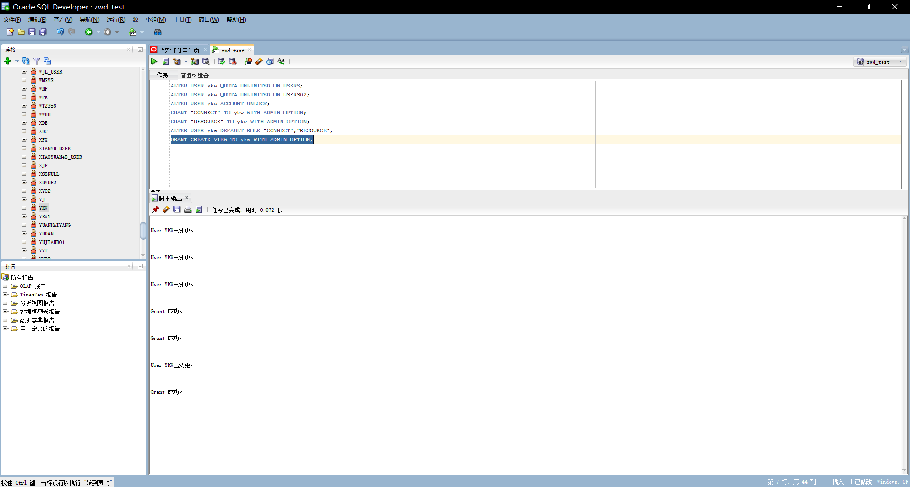

- 删除表和序列
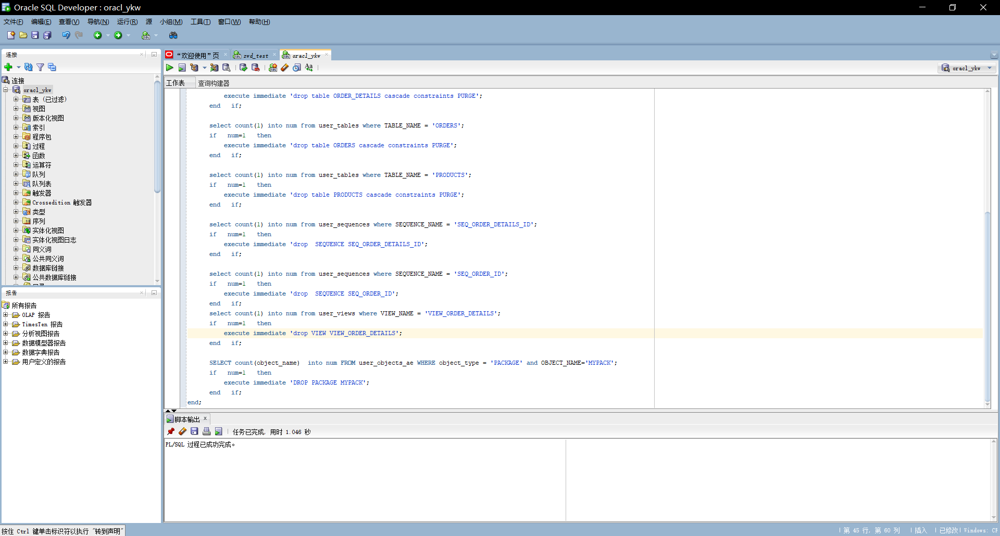

- 创建表，部分语句如下：

``` sql
CREATE TABLE DEPARTMENTS
(
  DEPARTMENT_ID NUMBER(6, 0) NOT NULL
, DEPARTMENT_NAME VARCHAR2(40 BYTE) NOT NULL
, CONSTRAINT DEPARTMENTS_PK PRIMARY KEY
  (
    DEPARTMENT_ID
  )
  USING INDEX
  (
      CREATE UNIQUE INDEX DEPARTMENTS_PK ON DEPARTMENTS (DEPARTMENT_ID ASC)
      NOLOGGING
      TABLESPACE USERS
      PCTFREE 10
      INITRANS 2
      STORAGE
      (
        INITIAL 65536
        NEXT 1048576
        MINEXTENTS 1
        MAXEXTENTS UNLIMITED
        BUFFER_POOL DEFAULT
      )
      NOPARALLEL
  )
  ENABLE
)
NOLOGGING
TABLESPACE USERS
PCTFREE 10
INITRANS 1
STORAGE
(
  INITIAL 65536
  NEXT 1048576
  MINEXTENTS 1
  MAXEXTENTS UNLIMITED
  BUFFER_POOL DEFAULT
)
NOCOMPRESS NO INMEMORY NOPARALLEL;
```


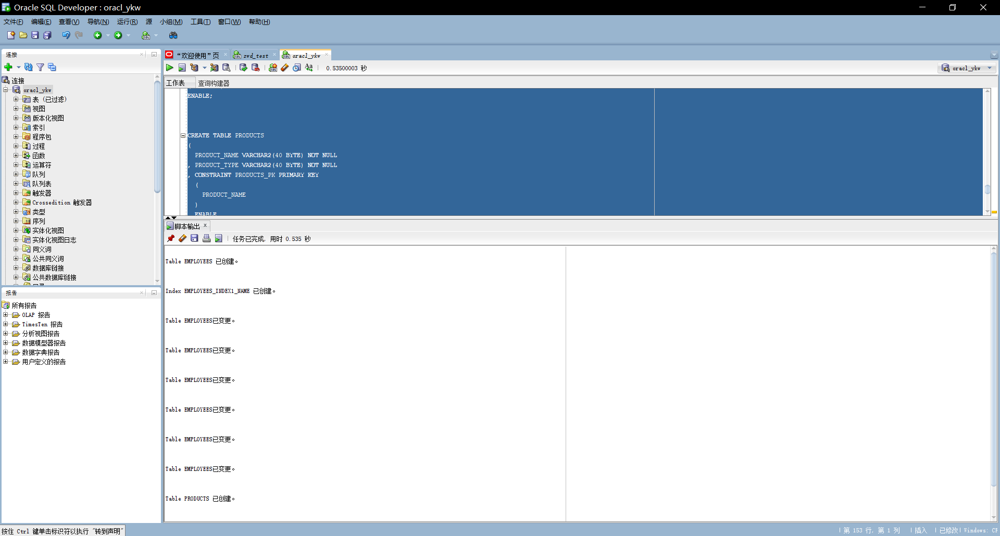
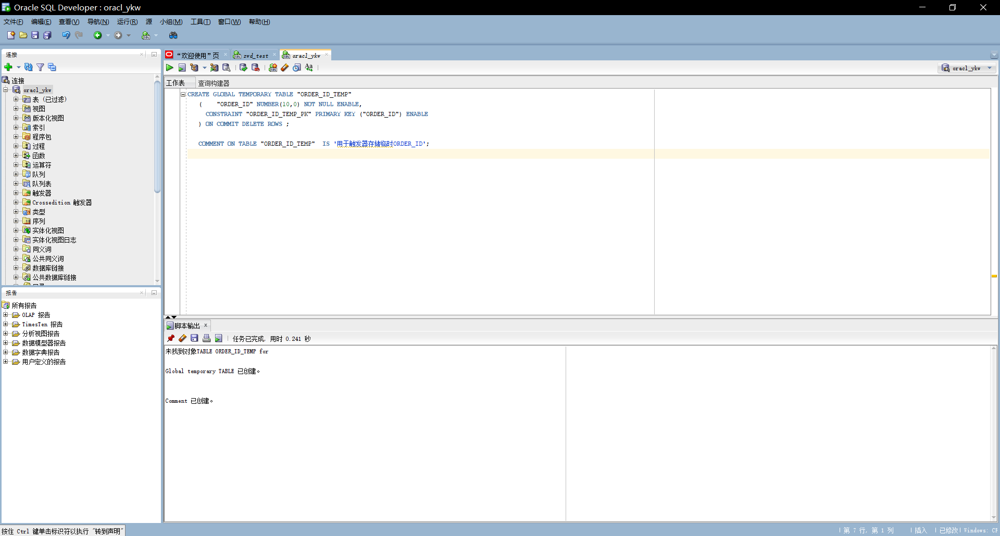
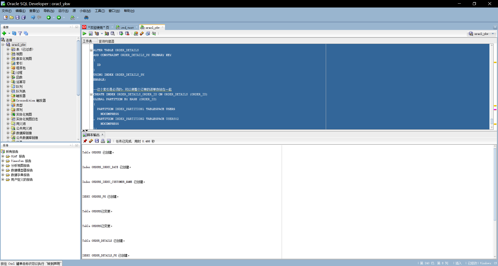

- 创建3个触发器
```sql
CREATE OR REPLACE EDITIONABLE TRIGGER "ORDERS_TRIG_ROW_LEVEL"
BEFORE INSERT OR UPDATE OF DISCOUNT ON "ORDERS"
FOR EACH ROW --行级触发器
declare
  m number(8,2);
BEGIN
  if inserting then
       :new.TRADE_RECEIVABLE := - :new.discount;
  else
      select sum(PRODUCT_NUM*PRODUCT_PRICE) into m from ORDER_DETAILS where ORDER_ID=:old.ORDER_ID;
      if m is null then
        m:=0;
      end if;
      :new.TRADE_RECEIVABLE := m - :new.discount;
  end if;
END;
/
--批量插入订单数据之前，禁用触发器
ALTER TRIGGER "ORDERS_TRIG_ROW_LEVEL" DISABLE;
```
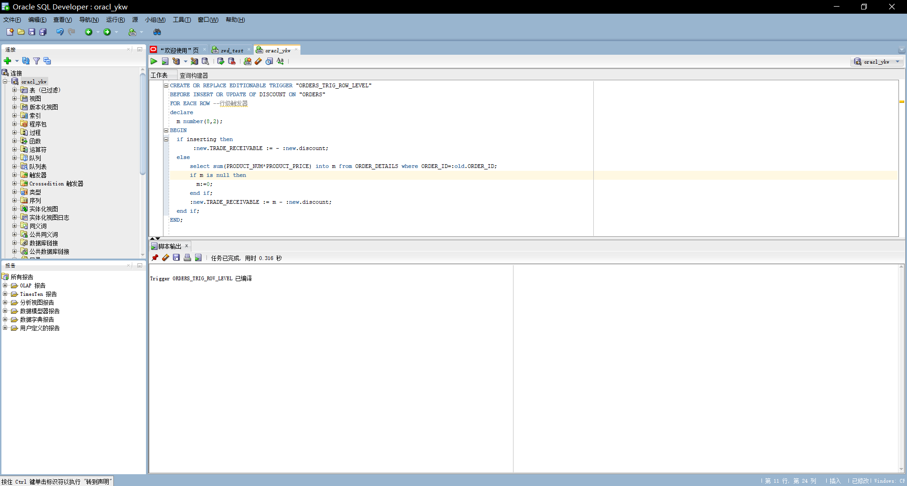
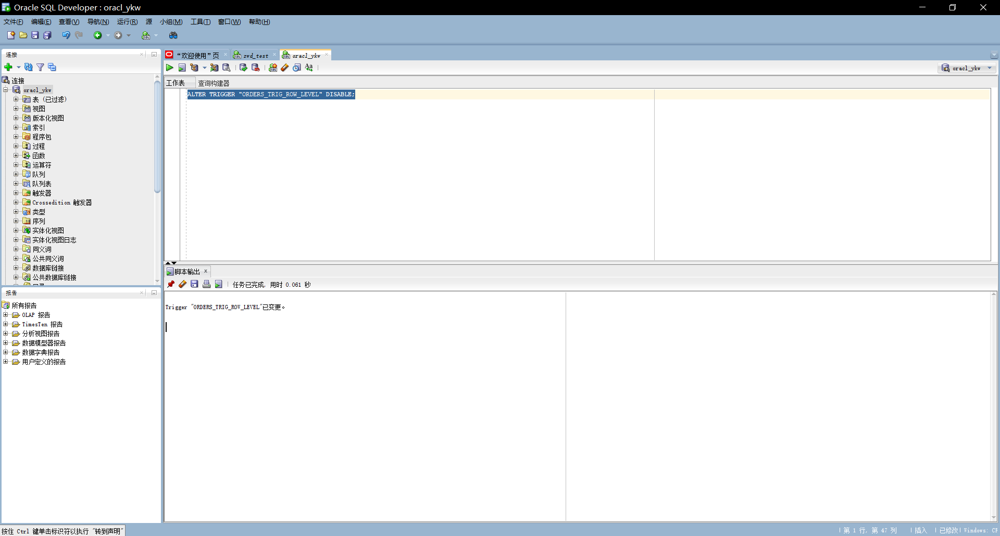
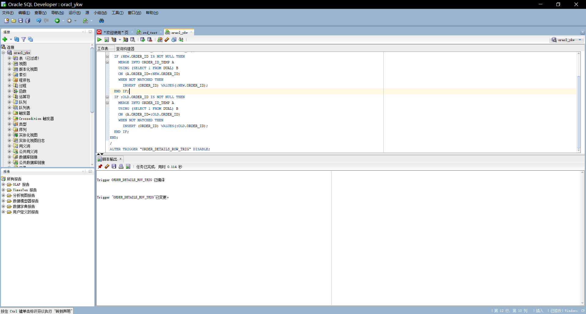
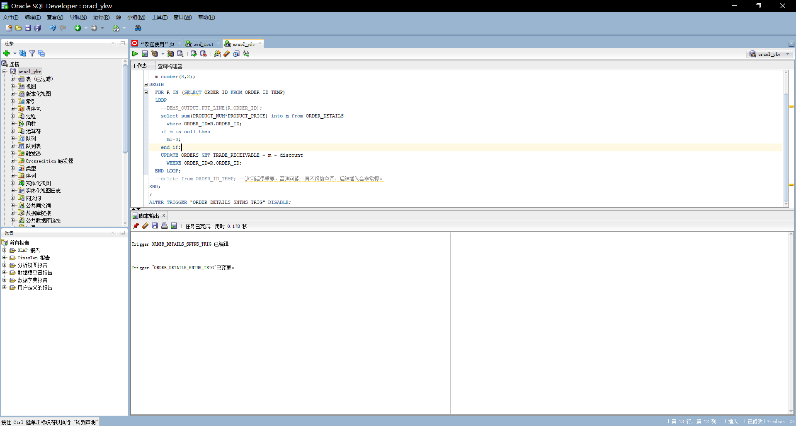

- 数据插入

```sql
--插入DEPARTMENTS，EMPLOYEES数据
INSERT INTO DEPARTMENTS(DEPARTMENT_ID,DEPARTMENT_NAME) values (1,'总经办');
INSERT INTO EMPLOYEES(EMPLOYEE_ID,NAME,EMAIL,PHONE_NUMBER,HIRE_DATE,SALARY,MANAGER_ID,DEPARTMENT_ID)
  VALUES (1,'李董事长',NULL,NULL,to_date('2010-1-1','yyyy-mm-dd'),50000,NULL,1);

INSERT INTO DEPARTMENTS(DEPARTMENT_ID,DEPARTMENT_NAME) values (11,'销售部1');
INSERT INTO EMPLOYEES(EMPLOYEE_ID,NAME,EMAIL,PHONE_NUMBER,HIRE_DATE,SALARY,MANAGER_ID,DEPARTMENT_ID)
  VALUES (11,'张总',NULL,NULL,to_date('2010-1-1','yyyy-mm-dd'),50000,1,1);
INSERT INTO EMPLOYEES(EMPLOYEE_ID,NAME,EMAIL,PHONE_NUMBER,HIRE_DATE,SALARY,MANAGER_ID,DEPARTMENT_ID)
  VALUES (111,'吴经理',NULL,NULL,to_date('2010-1-1','yyyy-mm-dd'),50000,11,11);
INSERT INTO EMPLOYEES(EMPLOYEE_ID,NAME,EMAIL,PHONE_NUMBER,HIRE_DATE,SALARY,MANAGER_ID,DEPARTMENT_ID)
  VALUES (112,'白经理',NULL,NULL,to_date('2010-1-1','yyyy-mm-dd'),50000,11,11);

INSERT INTO DEPARTMENTS(DEPARTMENT_ID,DEPARTMENT_NAME) values (12,'销售部2');
INSERT INTO EMPLOYEES(EMPLOYEE_ID,NAME,EMAIL,PHONE_NUMBER,HIRE_DATE,SALARY,MANAGER_ID,DEPARTMENT_ID)
  VALUES (12,'王总',NULL,NULL,to_date('2010-1-1','yyyy-mm-dd'),50000,1,1);
INSERT INTO EMPLOYEES(EMPLOYEE_ID,NAME,EMAIL,PHONE_NUMBER,HIRE_DATE,SALARY,MANAGER_ID,DEPARTMENT_ID)
  VALUES (121,'赵经理',NULL,NULL,to_date('2010-1-1','yyyy-mm-dd'),50000,12,12);
INSERT INTO EMPLOYEES(EMPLOYEE_ID,NAME,EMAIL,PHONE_NUMBER,HIRE_DATE,SALARY,MANAGER_ID,DEPARTMENT_ID)
  VALUES (122,'刘经理',NULL,NULL,to_date('2010-1-1','yyyy-mm-dd'),50000,12,12);


insert into products (product_name,product_type) values ('computer1','电脑');
insert into products (product_name,product_type) values ('computer2','电脑');
insert into products (product_name,product_type) values ('computer3','电脑');

insert into products (product_name,product_type) values ('phone1','手机');
insert into products (product_name,product_type) values ('phone2','手机');
insert into products (product_name,product_type) values ('phone3','手机');

insert into products (product_name,product_type) values ('paper1','耗材');
insert into products (product_name,product_type) values ('paper2','耗材');
insert into products (product_name,product_type) values ('paper3','耗材');


--批量插入订单数据，注意ORDERS.TRADE_RECEIVABLE（订单应收款）的自动计算,注意插入数据的速度
--2千万条记录，插入的时间是：18100秒（约5小时）
declare
  dt date;
  m number(8,2);
  V_EMPLOYEE_ID NUMBER(6);
  v_order_id number(10);
  v_name varchar2(100);
  v_tel varchar2(100);
  v number(10,2);

begin
  for i in 1..10000
  loop
    if i mod 2 =0 then
      dt:=to_date('2015-3-2','yyyy-mm-dd')+(i mod 60);
    else
      dt:=to_date('2016-3-2','yyyy-mm-dd')+(i mod 60);
    end if;
    V_EMPLOYEE_ID:=CASE I MOD 6 WHEN 0 THEN 11 WHEN 1 THEN 111 WHEN 2 THEN 112
                                WHEN 3 THEN 12 WHEN 4 THEN 121 ELSE 122 END;
    --插入订单
    v_order_id:=SEQ_ORDER_ID.nextval; --应该将SEQ_ORDER_ID.nextval保存到变量中。
    v_name := 'aa'|| 'aa';
    v_name := 'zhang' || i;
    v_tel := '139888883' || i;
    insert /*+append*/ into ORDERS (ORDER_ID,CUSTOMER_NAME,CUSTOMER_TEL,ORDER_DATE,EMPLOYEE_ID,DISCOUNT)
      values (v_order_id,v_name,v_tel,dt,V_EMPLOYEE_ID,dbms_random.value(100,0));
    --插入订单y一个订单包括3个产品
    v:=dbms_random.value(10000,4000);
    v_name:='computer'|| (i mod 3 + 1);
    insert /*+append*/ into ORDER_DETAILS(ID,ORDER_ID,PRODUCT_NAME,PRODUCT_NUM,PRODUCT_PRICE)
      values (SEQ_ORDER_DETAILS_ID.NEXTVAL,v_order_id,v_name,2,v);
    v:=dbms_random.value(1000,50);
    v_name:='paper'|| (i mod 3 + 1);
    insert /*+append*/ into ORDER_DETAILS(ID,ORDER_ID,PRODUCT_NAME,PRODUCT_NUM,PRODUCT_PRICE)
      values (SEQ_ORDER_DETAILS_ID.NEXTVAL,v_order_id,v_name,3,v);
    v:=dbms_random.value(9000,2000);
    v_name:='phone'|| (i mod 3 + 1);
    insert /*+append*/ into ORDER_DETAILS(ID,ORDER_ID,PRODUCT_NAME,PRODUCT_NUM,PRODUCT_PRICE)
      values (SEQ_ORDER_DETAILS_ID.NEXTVAL,v_order_id,v_name,1,v);
    --在触发器关闭的情况下，需要手工计算每个订单的应收金额：
    select sum(PRODUCT_NUM*PRODUCT_PRICE) into m from ORDER_DETAILS where ORDER_ID=v_order_id;
    if m is null then
     m:=0;
    end if;
    UPDATE ORDERS SET TRADE_RECEIVABLE = m - discount WHERE ORDER_ID=v_order_id;
    IF I MOD 1000 =0 THEN
      commit; --每次提交会加快插入数据的速度
    END IF;
  end loop;
  --统计用户的所有表，所需时间很长：2千万行数据，需要1600秒，该语句可选
  --dbms_stats.gather_schema_stats(User,estimate_percent=>100,cascade=> TRUE); --estimate_percent采样行的百分比
end;
```
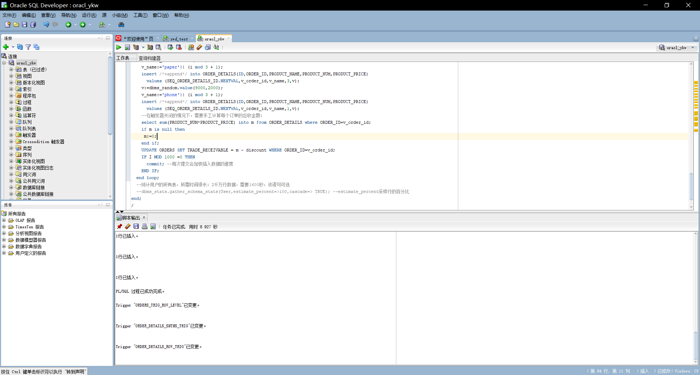

- 动态增加一个PARTITION_BEFORE_2018分区

```sql
ALTER TABLE ORDERS
ADD PARTITION PARTITION_BEFORE_2018 VALUES LESS THAN (TO_DATE(' 2018-01-01 00:00:00', 'SYYYY-MM-DD HH24:MI:SS', 'NLS_CALENDAR=GREGORIAN'));

```

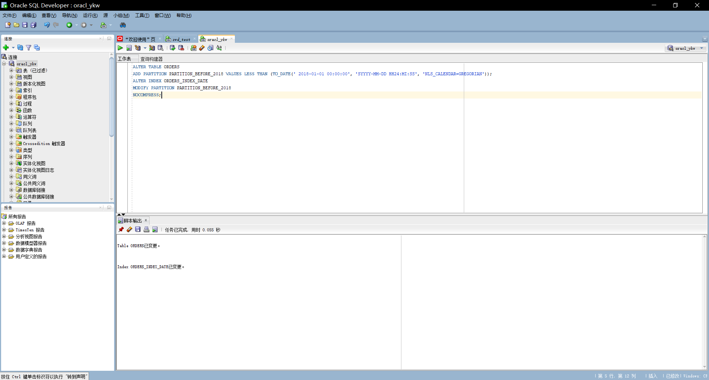

- 测试表（0.02s以内正常）：

```sql
select * from ORDERS where  order_id=1;
select * from ORDER_DETAILS where  order_id=1;
select * from VIEW_ORDER_DETAILS where order_id=1;
```
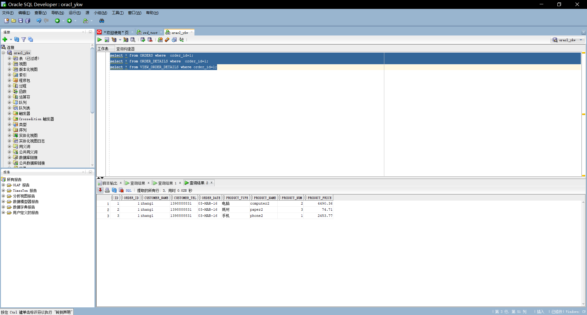

- 递归查询某个员工及其所有下属，子下属员工:

```sql
WITH A (EMPLOYEE_ID,NAME,EMAIL,PHONE_NUMBER,HIRE_DATE,SALARY,MANAGER_ID,DEPARTMENT_ID) AS
  (SELECT EMPLOYEE_ID,NAME,EMAIL,PHONE_NUMBER,HIRE_DATE,SALARY,MANAGER_ID,DEPARTMENT_ID
    FROM employees WHERE employee_ID = 11
    UNION ALL
  SELECT B.EMPLOYEE_ID,B.NAME,B.EMAIL,B.PHONE_NUMBER,B.HIRE_DATE,B.SALARY,B.MANAGER_ID,B.DEPARTMENT_ID
    FROM A, employees B WHERE A.EMPLOYEE_ID = B.MANAGER_ID)
SELECT * FROM A;
```
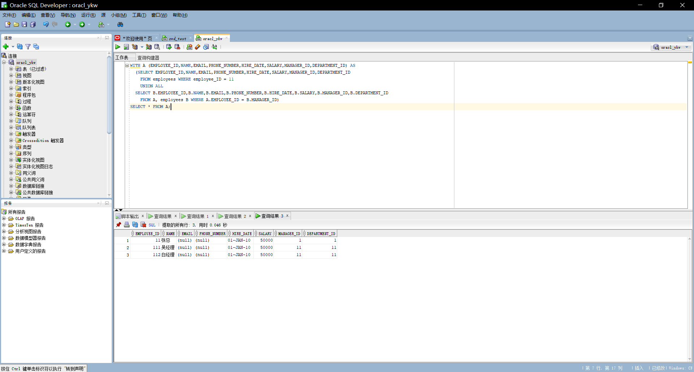

- 特殊查询语句：

```sql
-- 查询分区表情况:
select TABLE_NAME,PARTITION_NAME,HIGH_VALUE,PARTITION_POSITION,
TABLESPACE_NAME from user_tab_partitions
--查询分区索引情况：
select * from USER_IND_PARTITIONS;
```

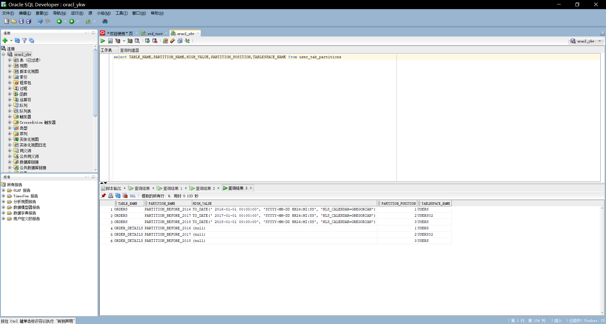
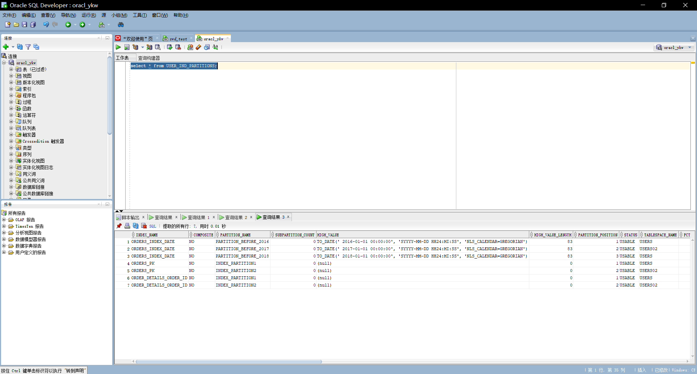

- 统计用户所有表后，查询表的统计信息

```sql
exec dbms_stats.gather_schema_stats(User,estimate_percent=>100,cascade=> TRUE); --estimate_percent采样行的百分比

--统计完成后，查询表的统计信息：
select table_name,tablespace_name,num_rows from user_tables where table_name='ORDERS';
select table_name,tablespace_name,num_rows from user_tables where table_name='ORDER_DETAILS';


select * from orders where order_id=1300;
select * from ORDER_DETAILS where order_id=1300;
select * from orders where customer_name='zhang133000';
select * from orders where order_date<to_date('2016-01-01','yyyy-mm-dd');

```

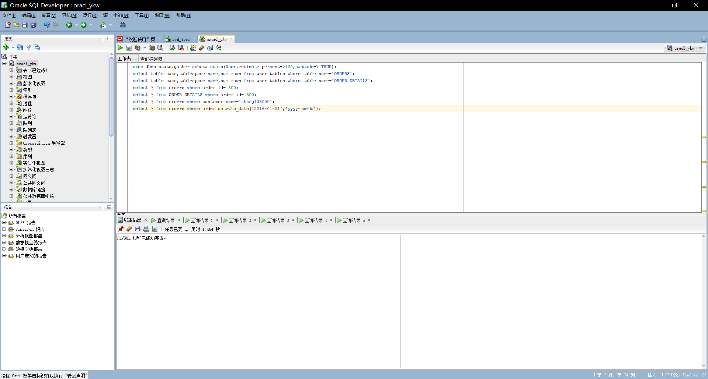